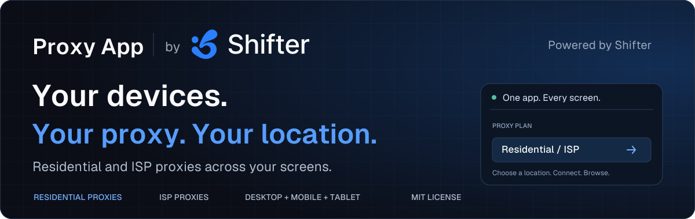

<p align="center">
  <a href="https://shifter.io/?utm_source=github&amp;utm_medium=referral&amp;utm_campaign=proxy_app&amp;utm_content=readme_header">
    
  </a>
</p>

<h1 align="center">Residential &amp; ISP Proxy App for Desktop, Mobile &amp; Tablet</h1>

<p align="center">
  Your devices. Your proxy. Your location.<br>
  <strong>Residential and ISP proxies. One app across your screens.</strong>
</p>

<p align="center">
  <a href="#get-started">Get Started</a> ·
  <a href="#why-shifter-proxy-app">Features</a> ·
  <a href="#residential-proxies-and-isp-proxies">Residential &amp; ISP</a> ·
  <a href="#platform-support">Platforms</a> ·
  <a href="https://shifter.io/docs?utm_source=github&amp;utm_medium=referral&amp;utm_campaign=proxy_app&amp;utm_content=readme_nav_docs">Shifter Docs</a>
</p>

**Shifter Proxy App** is a desktop, mobile, and tablet proxy client for [Shifter Residential Proxies](https://shifter.io/services/residential-proxies?utm_source=github&utm_medium=referral&utm_campaign=proxy_app&utm_content=readme_intro_residential) and [ISP Proxies](https://shifter.io/services/isp-proxies?utm_source=github&utm_medium=referral&utm_campaign=proxy_app&utm_content=readme_intro_isp). Connect a supported plan, choose a residential proxy location or an assigned ISP proxy, and check your exit IP from one interface. Manage rotating proxies, sticky sessions, and proxy bypass rules without entering gateway credentials into each compatible application.

Built with Flutter for **macOS, Windows, Linux, Android, iPhone, and iPad**, with layouts that adapt to desktop windows, phones, tablets, and foldables. Platform verification varies; see [platform support](#platform-support).

**Live proxy connections require a Shifter account, an API key, and an active supported proxy plan.** The app configures an HTTP proxy for applications that honor the operating system's proxy settings. It does not tunnel all device traffic or provide a device-wide kill switch.

## Contents

- [Why Shifter Proxy App?](#why-shifter-proxy-app)
- [Get started](#get-started)
- [Connect your device to a proxy](#connect-your-device-to-a-proxy)
- [Residential proxies and ISP proxies](#residential-proxies-and-isp-proxies)
- [Proxy workflows for SEO and website testing](#proxy-workflows-for-seo-and-website-testing)
- [Check your proxy exit IP](#check-your-proxy-exit-ip)
- [Platform support](#platform-support)
- [How proxy routing works](#how-proxy-routing-works)
- [Privacy and connection settings](#privacy-and-connection-settings)
- [About Shifter and its products](#about-shifter-and-its-products)
- [Development](#development)
- [FAQ](#faq)
- [Contributing and support](#contributing-and-support)
- [License](#license)

## Why Shifter Proxy App?

Review a localized website from your laptop, check a mobile storefront on your phone, or manage an ISP proxy session from a tablet. Shifter brings your supported proxy plans and connection controls into a consistent interface across screen sizes.

| Capability | What it helps you do |
| --- | --- |
| **Desktop, mobile, and tablet layouts** | Use a compact phone interface, tablet navigation rail, or desktop sidebar. |
| **Residential proxy targeting** | Choose country, state, city, and ASN where your plan supports those options. |
| **ISP proxy selection** | Select from the ISP proxies assigned to your plan, with location and network labels. |
| **Sticky and rotating proxies** | Request a residential session for a chosen duration or use rotating mode. |
| **New IP control** | Request a fresh residential session without signing in again. |
| **Exit IP and connection status** | Check the IP and country observed through the proxy connection. |
| **Plan and usage visibility** | Review supported plans, traffic allowance, and renewal or expiry information. |
| **Proxy settings** | Choose an available gateway entry point, enable strict targeting, and edit bypass rules. |
| **Secure API-key storage** | Store the API key using the platform's secure-storage integration. |

Targeting, sessions, and proxy availability follow your plan's capabilities. A new residential session requests a new exit; it does not guarantee a previously unused IP.

## Get started

This repository currently provides source builds. Requirements are **Flutter with Dart 3.13.4 or a compatible later 3.x SDK**, plus the native build tools for your target platform.

```sh
git clone https://github.com/shifter-io/proxy-app.git
cd proxy-app
flutter pub get
flutter devices
```

Run the desktop app on a Mac:

```sh
flutter run -d macos
```

Or choose an Android, iPhone, or iPad device from `flutter devices`:

```sh
flutter run -d <device-id>
```

Android proxy routing requires **Android 10 or later**. On iPhone and iPad, configure your own Apple development team and signing for both the app and Network Extension; a physical device is required to exercise the proxy connection. Desktop Windows and Linux targets are included, with verification status below.

To explore the interface without an account or live proxy traffic:

```sh
flutter run -d macos -t lib/main_preview.dart
```

The preview studio uses synthetic accounts and simulated connections. See the [development guide](docs/development.html) for platform setup, testing, and preview scenarios.

## Connect your device to a proxy

1. Sign in to your [Shifter account](https://shifter.io/login?utm_source=github&utm_medium=referral&utm_campaign=proxy_app&utm_content=readme_signin) and copy your API key from **Profile → API Key**.
2. Open the app and paste the key. The app verifies it and loads supported plans.
3. Choose a Residential or ISP proxy plan.
4. For Residential, select a location and session mode supported by your plan. For ISP, choose an assigned proxy.
5. Select **Connect**. On Android, iPhone, or iPad, allow the system connection configuration when prompted.
6. Check the displayed exit IP, then open a browser or application that honors system proxy settings.

Use **Disconnect** when finished. Desktop proxy settings are saved before connecting and restored when disconnecting. Signing out removes the stored API session.

## Residential proxies and ISP proxies

| | Residential proxies | ISP proxies |
| --- | --- | --- |
| **Selection** | Country, state, city, and ASN, depending on the plan. | A proxy assigned to your plan, identified by location and network. |
| **Sessions** | Sticky sessions with a configurable duration, or rotating mode. | The selected ISP proxy's assigned gateway credentials. |
| **Switching** | Change location or use New IP to request a fresh residential session. | Select another assigned ISP proxy. |
| **Typical workflow** | Compare localized pages and website behavior across available residential locations. | Keep browsing through a selected ISP proxy endpoint. |

**Full Geo** Residential plans support country, state, city, and ASN targeting. **Country Geo** plans expose country selection; **Non-Geo** plans do not expose location targeting. The app follows the capabilities returned for each plan. Legacy products and plans without supported app gateway credentials are not offered as usable connections.

Sticky residential sessions request continuity for the selected duration. Exit availability can change, so a session is not a guarantee of an unchanged IP. Strict targeting asks the gateway to fail rather than broaden an unavailable location or network selection.

## Proxy workflows for SEO and website testing

- **Regional SEO checks.** Inspect localized search pages and landing pages from a selected market. Language, account state, cookies, and personalization can still affect results.
- **Website localization QA.** Compare language, currency, regional content, and redirects on your own website across desktop, phone, and tablet browsers.
- **Storefront and price checks.** Review how your public product pages and offers appear through available residential locations.
- **Ad verification.** Inspect your campaigns and landing pages from a selected location or network.
- **Connection troubleshooting.** Compare direct and proxied browsing, check the observed exit IP, and review bypass settings.

The app is designed for interactive proxy connections. For automated web scraping, structured search results, or repeatable rank tracking, use Shifter's proxy endpoints and APIs in your own tooling.

## Check your proxy exit IP

The app uses [IP Info](https://ip-info.com/?utm_source=github&utm_medium=referral&utm_campaign=proxy_app&utm_content=readme_exit_ip) to display the IP and country observed through its proxy connection. Open IP Info in the browser you intend to use to check that browser's exit and reported network details too.

The app's lookup confirms the route used by that request; another application may ignore system proxy settings. IP geolocation is approximate. With rotating proxies, subsequent requests may use different exit IPs.

## Platform support

| Platform | Proxy integration | Verification recorded in this repository |
| --- | --- | --- |
| **macOS 12+** | Local proxy and system network proxy settings. | Local macOS connection and restoration checks. |
| **Windows** | Local proxy and WinINet proxy settings. | Implemented; not yet verified on Windows. |
| **Linux / GNOME** | Local proxy and GNOME `gsettings`. | Implemented; not yet verified on Linux. Other desktop environments are not covered. |
| **Android 10+** | Android connection service advertises the local HTTP proxy. | End-to-end checks recorded on Android 10 and 16, including phone and tablet. |
| **iPhone / iPad, iOS 15+** | Network Extension supplies proxy settings and hosts the local proxy. | Live connection check recorded on iPhone. iPad layout is included; physical iPad routing is not independently verified. |

These are existing project verification notes, not a claim that every platform was retested for this README. Release packaging, store distribution, and production signing are separate from running a source build.

## How proxy routing works

The app runs a local HTTP proxy that authenticates to the selected Shifter gateway. Compatible applications send HTTP requests and HTTPS CONNECT tunnels through it. Changing a location, session, or ISP selection updates gateway credentials and closes existing tunnels so the new selection can take effect.

On desktop, the app applies system proxy settings and saves the previous configuration for restoration on disconnect, sign-out, quit, or recovery after a crash. Applications with independent network settings may need their own proxy configuration or may bypass this integration entirely.

Android uses `VpnService` to advertise proxy settings; iOS uses a Network Extension. These operating-system APIs can display a VPN permission prompt or indicator, but the app's routing is proxy based. UDP traffic, including many WebRTC and gaming connections, is not carried by the HTTP proxy. There is no device-wide kill switch.

macOS builds run outside App Sandbox because changing network proxy settings requires access blocked by the sandbox. Distribution uses Developer ID signing rather than the Mac App Store. See the [development guide](docs/development.html) for architecture details.

## Privacy and connection settings

The API key is stored through `flutter_secure_storage` and sent to Shifter for authenticated account requests. Non-secret preferences, selected locations, and account display data are stored separately. Gateway credentials authenticate the proxy connection.

Loopback destinations and Shifter's account/API domains always bypass the proxy so the account remains reachable. Additional hostname, wildcard, and IPv4/CIDR bypass rules can be managed in Settings. Bypassed destinations connect directly.

The app does not clear website cookies when you connect or change locations. Sites can still recognize signed-in accounts. A proxy changes the network exit for traffic that uses it; it does not remove browser or account identifiers.

## About Shifter and its products

[Shifter](https://shifter.io/?utm_source=github&utm_medium=referral&utm_campaign=proxy_app&utm_content=readme_about_shifter) builds proxy infrastructure and web data APIs for developers, data teams, and businesses. Its products support web scraping, SEO monitoring, ad verification, price intelligence, and AI data workflows.

| Product | What it offers | Useful for |
| --- | --- | --- |
| [**Residential Proxies**](https://shifter.io/services/residential-proxies?utm_source=github&utm_medium=referral&utm_campaign=proxy_app&utm_content=readme_residential_proxies) | Residential proxy access with geo targeting, rotation, and sticky sessions. | Localized browsing, scraping, and distributed data collection. |
| [**ISP Proxies**](https://shifter.io/services/isp-proxies?utm_source=github&utm_medium=referral&utm_campaign=proxy_app&utm_content=readme_isp_proxies) | ISP proxy plans with assigned locations and networks. | Workflows that need a selected proxy endpoint. |
| [**Web Scraping API**](https://shifter.io/services/scraping-api?utm_source=github&utm_medium=referral&utm_campaign=proxy_app&utm_content=readme_scraping_api) | Managed web content retrieval with proxy handling and rendering options. | Programmatic page collection. |
| [**SERP API**](https://shifter.io/services/serp-api?utm_source=github&utm_medium=referral&utm_campaign=proxy_app&utm_content=readme_serp_api) | Structured search engine results through an API. | Rank tracking, keyword research, and search data pipelines. |

[Explore Shifter](https://shifter.io/?utm_source=github&utm_medium=referral&utm_campaign=proxy_app&utm_content=readme_shifter_cta) · [View pricing](https://shifter.io/pricing?utm_source=github&utm_medium=referral&utm_campaign=proxy_app&utm_content=readme_pricing) · [Read the documentation](https://shifter.io/docs?utm_source=github&utm_medium=referral&utm_campaign=proxy_app&utm_content=readme_shifter_docs)

Related projects:

- [**Proxy Extension**](https://github.com/shifter-io/proxy-extension): Residential and ISP proxy controls for Chrome and Firefox.
- [**Web Proxy**](https://github.com/shifter-io/web-proxy): browser-based proxy browsing and an embeddable SDK.
- [**IP Info**](https://github.com/shifter-io/ip-info): IP geolocation and ASN lookup, used for the app's exit-IP check.

## Development

Built with Flutter and Dart, with native platform integration for system proxy settings and mobile connection services. A normal build uses the bundled location catalog, fonts, flags, and brand assets.

```sh
flutter pub get
flutter analyze
flutter test
flutter run -d macos -t lib/main_preview.dart
```

| Directory | Contents |
| --- | --- |
| `lib/data/` | Live Shifter API client, secure storage, models, and synthetic preview data. |
| `lib/proxy/` | Local HTTP proxy, gateway authentication, bypass rules, and platform adapters. |
| `lib/state/` | Plan selection, connection lifecycle, location, and session controls. |
| `lib/ui/` | Responsive screens and shared interface components. |
| `android/` and `ios/` | Mobile connection services and native integration. |
| `macos/`, `windows/`, and `linux/` | Desktop runners and platform build configuration. |
| `test/` and `integration_test/` | Unit, widget, rendering, and connection checks. |
| `tool/` | Device checks, local benchmarks, and asset generators. |
| `docs/` | Standalone HTML documentation and the README banner. |

The [development guide](docs/development.html) preserves the detailed routing notes, existing benchmark results, device test commands, layout breakpoints, and catalog maintenance instructions. Benchmarks describe local proxy overhead, not internet or residential network throughput.

To rebuild the offline documentation after editing Markdown:

```sh
python3 -m pip install Markdown
python3 tool/render_docs.py
```

The banner generator additionally uses `fonttools` and the bundled Geist fonts. Neither documentation generation nor banner generation is required to build the app.

## FAQ

### Can I use residential proxies on desktop, mobile, and tablet?

Yes, with a supported Shifter plan and the appropriate platform build. The interface adapts to the screen size. Only applications that honor the configured proxy settings use the connection; see the platform table for verification status.

### Does the app support ISP proxies?

Yes. Choose a supported ISP plan and select one of its assigned proxies. The app applies that proxy's gateway credentials to its local proxy connection.

### Is this a free proxy app?

The source code is available under the MIT license. The app does not include free Residential or ISP proxy traffic. Live connections require an active supported Shifter plan. The preview studio runs without a paid plan and simulates connections for interface development.

### Is Shifter Proxy App a VPN?

It is an HTTP proxy client. Android and iOS use system connection APIs that can show a VPN indicator, but the app does not tunnel all IP traffic. Applications that ignore proxy settings and UDP traffic can connect directly.

### Can I use rotating proxies or keep a sticky residential session?

Supported Residential plans offer rotating mode and sticky sessions with a chosen duration. New IP requests a fresh session. A sticky session cannot guarantee an exit remains available indefinitely.

### Does a mobile proxy app provide mobile-network IPs?

Running the app on a phone does not change the proxy product. The exit comes from your selected Residential or ISP plan; using Android or iOS does not make it a cellular or 4G/5G proxy.

### Can I import a proxy list from another provider?

The current app integrates with Shifter accounts, plans, and gateway credentials. It does not provide a generic proxy-list importer.

### Can I use the app for automated web scraping?

The app provides interactive connection controls. For automated scraping, configure Shifter's proxy endpoints directly in your HTTP client or use the Web Scraping API. For structured search data, use the SERP API.

## Contributing and support

Report app bugs and propose improvements at [shifter-io/proxy-app](https://github.com/shifter-io/proxy-app). Include the platform, operating-system version, reproduction steps, and expected behavior. Run the relevant checks before submitting code changes.

Use [Shifter's support resources](https://shifter.io/docs?utm_source=github&utm_medium=referral&utm_campaign=proxy_app&utm_content=readme_support) for account or service questions. Remove API keys, proxy passwords, account details, and browsing history from reports.

## License

Project source is released under the [MIT License](LICENSE). Third-party dependencies, fonts, and assets retain their own licenses. Shifter branding retains its respective rights. See [third-party asset notices](docs/third-party-notices.html).
